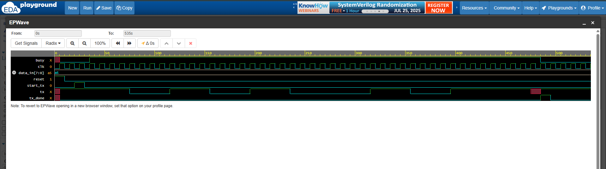

# Custom UART Transmitter (Verilog)

A UART Transmitter built using Verilog and simulated with Icarus Verilog and GTKWave. It transmits 8-bit serial data using a finite state machine (FSM) and supports start and stop bits. The testbench was developed and verified using EDA Playground.

---

## 📄 Files Included

| File                     | Description                              |
|--------------------------|------------------------------------------|
| `uart_tx_upgraded.v`     | UART Transmitter Verilog design          |
| `uart_tx_upgraded_tb.v`  | Testbench (copied from EDA Playground)   |
| `uart_waveform.png`      | Screenshot of UART waveform from GTKWave |

---

## 📈 Waveform

